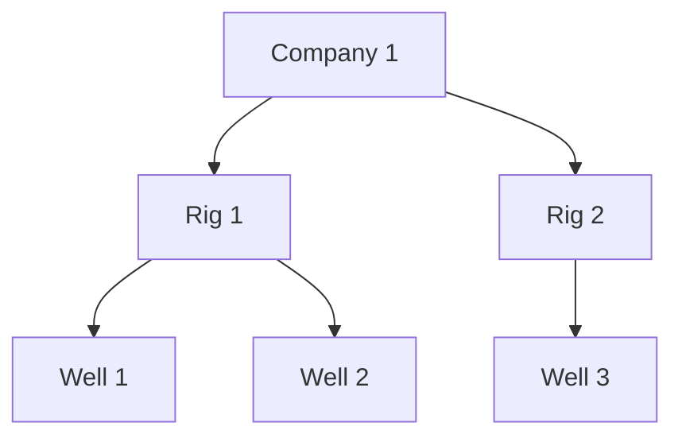

# Settings Hierarchy

This document explains how settings are resolved across company and asset scopes.

## Resolution Order

When you request settings for a scope, the service merges settings in this order:

1. Package defaults
2. Company scope
3. Ancestor asset scopes, from highest parent down to the requested asset
4. Requested asset scope

Later layers override earlier layers.

Only the direct ancestry chain for the requested asset is considered. Sibling assets and unrelated branches do not affect the result.

## Example Hierarchy



If you request settings for `Well 1`, the service resolves this chain:

```text
Package defaults -> Company 1 -> Rig 1 -> Well 1
```

These scopes are not used for `Well 1`:

- `Well 2`
- `Rig 2`
- `Well 3`

## Example: Company And Rig Settings

Company 1 settings:

```json
{
  "dysfunction_detection": {
    "is_enabled": true,
    "wob_threshold": 10
  },
  "notifications": {
    "is_enabled": true
  }
}
```

Rig 1 settings:

```json
{
  "dysfunction_detection": {
    "wob_threshold": 20
  }
}
```

Well 1 has no directly stored settings.

Effective settings for `Well 1`:

```json
{
  "dysfunction_detection": {
    "is_enabled": true,
    "wob_threshold": 20
  },
  "notifications": {
    "is_enabled": true
  }
}
```

What happened:

- `dysfunction_detection.wob_threshold` came from `Rig 1`
- `dysfunction_detection.is_enabled` stayed from `Company 1`
- `notifications.is_enabled` stayed from `Company 1`

## Example: Company, Rig, And Well Settings

Using the same company and rig settings as above, add this `Well 1` document:

```json
{
  "dysfunction_detection": {
    "is_enabled": false
  },
  "well_label": "Primary"
}
```

Effective settings for `Well 1`:

```json
{
  "dysfunction_detection": {
    "is_enabled": false,
    "wob_threshold": 20
  },
  "notifications": {
    "is_enabled": true
  },
  "well_label": "Primary"
}
```

What happened:

- `dysfunction_detection.is_enabled` was overridden by `Well 1`
- `dysfunction_detection.wob_threshold` still came from `Rig 1`
- `notifications.is_enabled` still came from `Company 1`
- `well_label` was added by `Well 1`

## Nested Merge Rules

Settings are merged deeply when both values are objects.

Example:

Earlier layer:

```json
{
  "dysfunction_detection": {
    "parameters": {
      "wob_threshold": 10,
      "rpm_threshold": 120
    }
  }
}
```

Later layer:

```json
{
  "dysfunction_detection": {
    "parameters": {
      "rpm_threshold": 140
    }
  }
}
```

Result:

```json
{
  "dysfunction_detection": {
    "parameters": {
      "wob_threshold": 10,
      "rpm_threshold": 140
    }
  }
}
```

If a later layer sets a key to a non-object value, it replaces the earlier value entirely.

Example:

Earlier layer:

```json
{
  "dysfunction_detection": {
    "parameters": {
      "wob_threshold": 10,
      "rpm_threshold": 120
    }
  }
}
```

Later layer:

```json
{
  "dysfunction_detection": {
    "parameters": "disabled"
  }
}
```

Result:

```json
{
  "dysfunction_detection": {
    "parameters": "disabled"
  }
}
```

## Practical Rules

- Company settings apply to every asset in that company unless a more specific scope overrides them.
- Parent asset settings apply to all descendants under that parent.
- A child asset can override part of a nested object without replacing the whole object.
- Sibling scopes never affect each other.
- `explain_settings(...)` is the best way to inspect which layers contributed to the final result.
